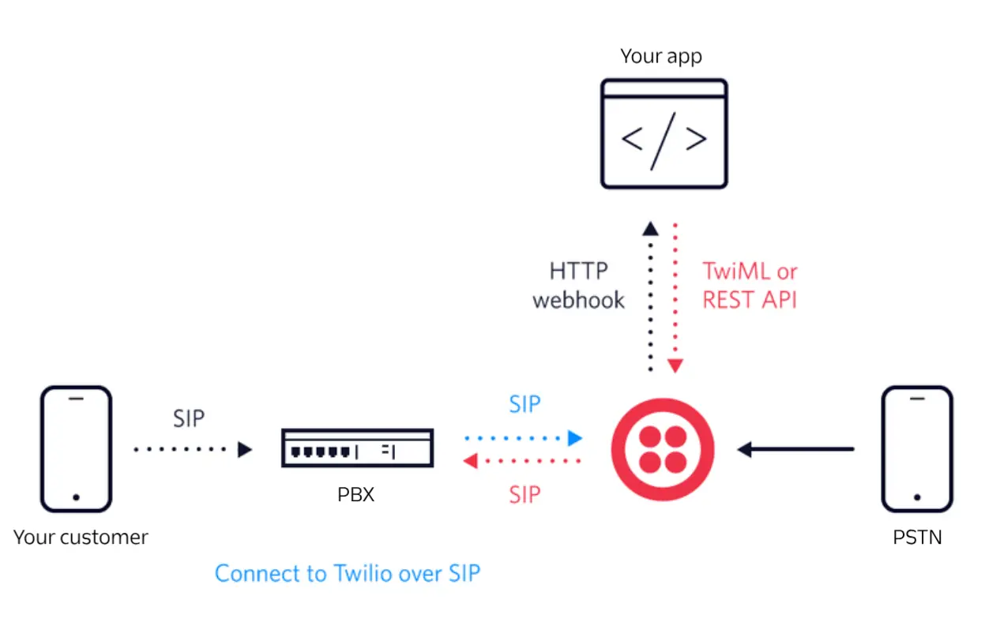

# Twilio SIP Integration Architecture

## Overview

## Components

### 1. Your Application
- Controls call flow using [Twilio REST API](https://www.twilio.com/docs/usage/api)
- Responds to webhooks using [TwiML](https://www.twilio.com/docs/voice/twiml)

### 2. PBX System
- Connects to Twilio via [SIP Interface](https://www.twilio.com/docs/voice/sip)
- Handles internal routing
- [SIP Trunking Documentation](https://www.twilio.com/docs/voice/sip/sip-trunking)

### 3. Twilio Platform
- Processes [HTTP webhooks](https://www.twilio.com/docs/usage/webhooks)
- Manages [SIP Registration](https://www.twilio.com/docs/voice/sip/registering)
- [Voice API Documentation](https://www.twilio.com/docs/voice/api)

### 4. PSTN Connection
- [Public Switched Telephone Network](https://www.twilio.com/docs/glossary/what-is-pstn)
- Global voice connectivity

## Quick Links
- [Getting Started with SIP](https://www.twilio.com/docs/voice/sip/getting-started)
- [API Reference](https://www.twilio.com/docs/voice/api/getting-started)
- [TwiML Documentation](https://www.twilio.com/docs/voice/twiml)
- [Troubleshooting Guide](https://www.twilio.com/docs/voice/troubleshooting)

## Integration Steps
1. [Configure SIP Domain](https://www.twilio.com/docs/voice/sip/domains)
2. [Set up Authentication](https://www.twilio.com/docs/voice/sip/authentication)
3. [Create TwiML App](https://www.twilio.com/docs/usage/tutorials/how-to-create-twiml-app)
4. [Handle Webhooks](https://www.twilio.com/docs/usage/webhooks/voice-webhooks)
